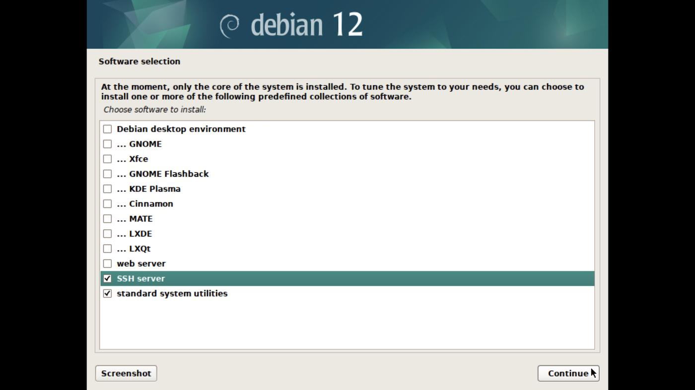

## Debian Xfce4 Minimal Install Guide

The standard Debian installation process for Xfce desktop includes additional packages that may not be necessary for many users. This guide will allow you to install a minimal Xfce desktop, adding additional packages as needed.  

## Requirements

* A debian installation (hardware or virtual machine) with appropriate video drivers.

* sudo privileges to install packages and run optional install script.

* Installation of `git` to clone this repo `sudo pkg install git`

* Installation of `bash` to run install script `sudo pkg install bash`

## ISO for Installing Debian

* [debian-11.2.0-amd64-netinst.iso](https://cdimage.debian.org/debian-cd/current/amd64/iso-cd/debian-11.2.0-amd64-netinst.iso)

* [Installing Debian 11.2](https://www.debian.org/releases/bullseye/debian-installer/)  

* [Debian “bullseye” Release Information](https://www.debian.org/releases/bullseye/)

## Installing Debian without a desktop environment

As you progress through the debian installation, towards the end you will be presented with the following screen for Software selection:



Uncheck **Debian desktop environment** to install a minimal debian system.

## Update sources to testing or unstable (optional)

Updates sources to `bookworm`. The current testing branch.

`sudo nano /etc/apt/sources`:

```bash
deb http://deb.debian.org/debian bookworm main
deb-src http://deb.debian.org/debian bookworm main

deb http://deb.debian.org/debian-security/ bookworm-security main
deb-src http://deb.debian.org/debian-security/ bookworm-security main

deb http://deb.debian.org/debian bookworm-updates main
deb-src http://deb.debian.org/debian bookworm-updates main

# deb http://deb.debian.org/debian bookworm-backports main
# deb-src http://deb.debian.org/debian bookworm-backports main
```

Add `contrib non-free` after each `main` entry if you need special drivers or additional firmware.

The other option would be debian sid. Update `sources` as follows:

```bash
deb http://deb.debian.org/debian/ unstable main
deb-src http://deb.debian.org/debian/ unstable main
```

Upgrade your system:

```bash
sudo apt update && apt upgrade
```

Reboot to load updated kernel and services.

## Quick install Xfce and required packages

```bash
git clone https://github.com/coonrad/Debian-Xfce4-Minimal-Install.git
cd Debian-Xfce4-Minimal-Install
sudo ./xfce-install.sh
```

## Manually install Xfce and required packages

If you've read this far, and you're getting impatient:

```bash
sudo apt install xfce4
```

This will give you a basic Xfce desktop with lightdm greeter. For additional plugins and ''goodies', add:

```bash
sudo apt install xfce4-goodies
```

This still may include too much 'stuff' for the minimalists among us. In that case, strip it down further and start with:

```bash
apt install \
    libxfce4ui-utils \
    thunar \
    xfce4-appfinder \
    xfce4-panel \
    xfce4-session \
    xfce4-settings \
    xfce4-terminal \
    xfconf \
    xfdesktop4 \
    xfwm4
```

From this point you should have a working Xfce desktop environment. You can reboot, and add only what you need going forward.

## Additional packages and configuration

Add a browser, password manager, document viewer, image viewer and office apps:

```bash
sudo apt install firefox-esr keepassxc atril ristretto libreoffice-gtk3 \
libreoffice-calc libreoffice-writer
```

Add NetworkManager and openvpn:

```bash
sudo apt install network-manager-openvpn network-manager-gnome \
network-manager-openvpn-gnome
```

Add a few nice icon themes to choose from:

```bash
sudo apt install paper-icon-theme moka-icon-theme papirus-icon-theme
```

Keep the default Adwaita theme as scientists have proven it is the best theme. Xfce comes with Lightdm for the display manager. It sources `.xessionrc` on login. Here are a few useful additions:

```bash
# source the system profile
# if [ -f /etc/profile ]; then
#     . /etc/profile
# fi

# QT5 qt5ct
export QT_QPA_PLATFORMTHEME=qt5ct

# QT5 scaling
# Uncomment for hidpi display
# export QT_AUTO_SCREEN_SCALE_FACTOR=1
# export QT_SCREEN_SCALE_FACTORS=2
```

Install `qt5ct` and `adwaita-qt` to have your QT apps match the default GTK theme.

```bash
sudo apt install qt5ct adwaita-qt
```

Launch `qt5ct` and configure the theme and fonts.
